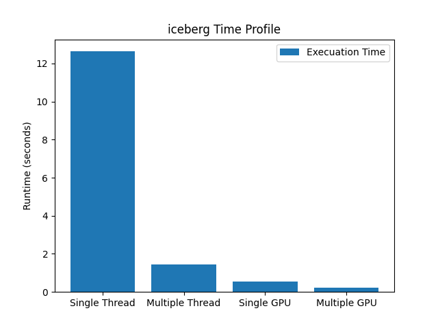
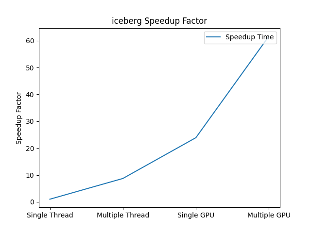
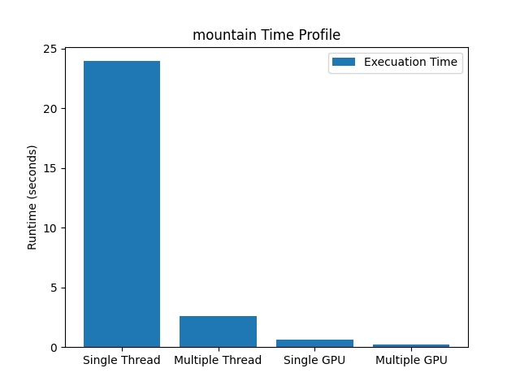
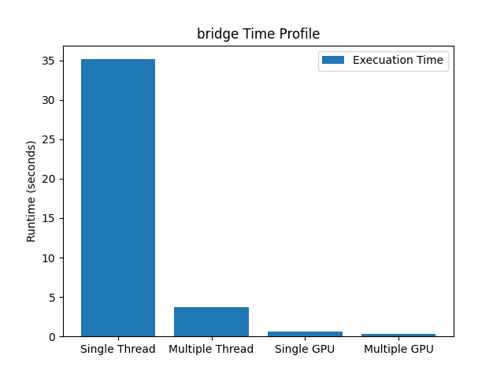
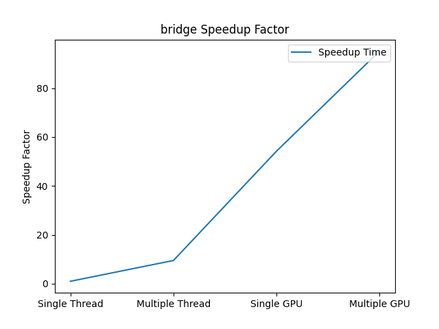
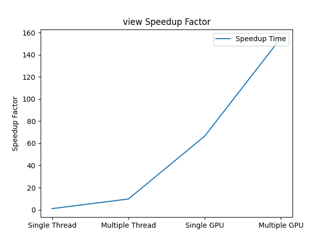
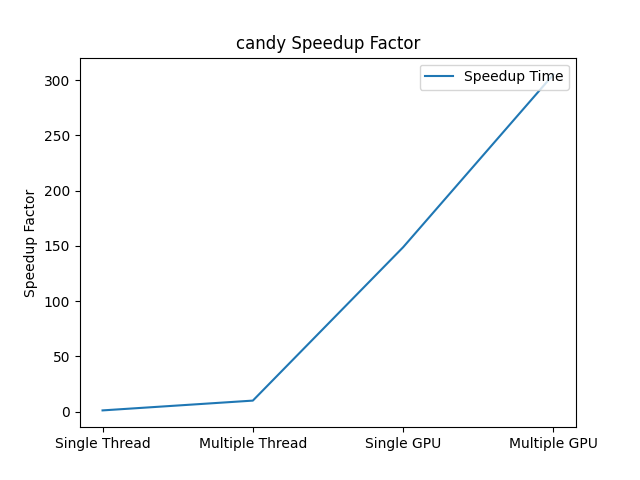

# Gaussian-Blur-CUDA
- We implement Gaussian Blur with C++ (Sequential), OpenMP, and CUDA
- We used different size image to compare their performance

## Build with
- C++
- OpenMP
- CUDA

## Getting Started
1. cd into the directory
2. modify the script.sh to choose the input and filter size you want
3. execute the script.sh (make sure Makefile is here)</br>
- Example to execute single-gpu program (make sure that you have already had gpu and cuda installed)

```
cd src/Single-GPU
./script.sh
```

## Result
Before | After
:-----:|:------:|
 | 
 |
 | 


## Experiment
- CPU: Intel(R) Xeon(R) CPU           X5670  @ 2.93GHz
- GPU: GEFORCE GTX 1080 Ti
### Single Thread with different Optimization Skill
- Compare their **computation time** in same testcase
- V1: Original Gaussian Blur Algorithm
- V2: Add ffast-math flag to speed up the math operation
- V3: Calculate Gaussian Filter to save redundant operation


Filename | Size | V1 | V2 | V3
:----------:|:-----------------:|:-------------------:|:----------:|:-----------------:
bridge.png|2.1 MB|151.34(s)|123.039(s)|35.3384(s)

Time Profile | Speedup Factor
:------------:|:---------------:|
 | 

### Performance Comparison with different Thread number
Filename | Size | 1 thread | 2 thread | 4 thread | 8 thread | 12 thread
:----------:|:-----------------:|:-------------------:|:----------:|:-----------------:|:--------------:|:------
view.png|2.1 MB|25.0505(s)|12.566(s)|6.27131(s)|4.83035(s)|2.14292(s)

Time Profile | Speedup Factor
:------------:|:---------------:|
 | 


### Performance Comparison between Sequential, OpenMP, CUDA
- Filter Matrix size: 53*53
- Multiple threads: 8
- V3 version sequential implementation

Filename |Size|Single thread|Multiple threads|Single GPU
:----------:|:-----------------:|:-------------------:|:----------:|:-----------------:
iceberg.png|0.8 MB|12.6372(s)|1.44974(s)|0.528766(s)|
mountain.png|1.9 MB|23.9481(s)|2.5741(s)|0.594938(s)|
bridge.png |2.1 MB|35.1401(s)|3.69399(s)|0.647862(s)|
view.png|2.4 MB|46.6573(s)|4.82201(s)|0.701165(s)|
candy.png|13.9 MB|362.181(s)|36.6829(s)|2.43379(s)|

Time Profile | Speedup Factor
:------------:|:---------------:|
 | 
 | 
 | 
 | 
 | 
## Acknowledge
Our Gaussian Blur implementation is mainly based on the following two website.
- [Gaussian Blur introduction](https://en.wikipedia.org/wiki/Gaussian_blur)
- [Gaussian Blur implementation](http://blog.ivank.net/fastest-gaussian-blur.html)
